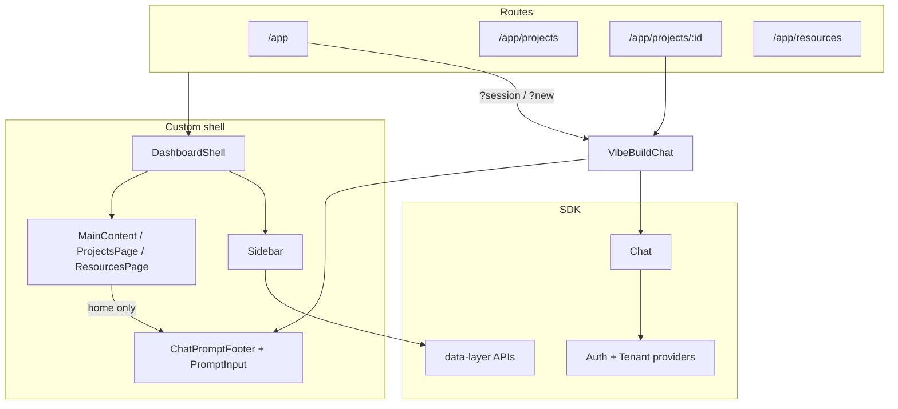

# Custom UI vs ibl.ai SDK — Gap Analysis

**App:** vibe.ibl.ai  
**SDK:** `@iblai/iblai-js` ^1.18.1 · `@iblai/web-containers` ^1.9.1 · `@iblai/data-layer` ^1.8.1  
**Last reviewed:** June 2026

---

## Executive summary

This app is a **hybrid**: a Lovable-style product shell (sidebar, home, projects grid, resources, connectors) wraps the SDK **`Chat`** component for agent/build sessions.

| Layer | What we use |
|-------|-------------|
| **Shell & navigation** | Almost entirely **custom** (`DashboardShell`, `sidebar.tsx`, route switching inside one `Dashboard` tree) |
| **Build / agent chat** | SDK **`Chat`** + custom prompt footer, CSS overrides, programmatic send/voice bridges |
| **Projects list** | **Custom UI** + real **`data-layer`** project APIs |
| **Project detail** | Thin route → **`VibeBuildChat`** with `projectId` (SDK **`ProjectLandingPage`**) |
| **Profile** | SDK **`UserProfileModal`** in a dialog |
| **Auth** | SDK providers + **custom** login / SSO handler pages |

**Not wired today:** SDK `AppSidebar`, server chat history, `NotificationDropdown`, `Account`, agent admin tabs, `ConnectorManagementDialog`, real template API.

---

## Architecture

---

## Surface-by-surface comparison

| Surface | Route | Custom (this app) | SDK | Data status |
|---------|-------|-------------------|-----|-------------|
| **App shell** | `/app/*` | `Dashboard`, `DashboardShell`, `OnyxUIProvider`, mobile overlay, connectors overlay | `IblaiProviders`, Redux store | Auth/tenant **real**; layout state **custom** |
| **Sidebar** | Persistent | Nav, collapse, recents, project filters, profile menu, demo notifications, admin nav scaffold | `useRecentChats`, `useProjects`, `useGetUserMetadataEdxQuery` | **Mixed** — projects **real**; recents **local**; notifications **mock** |
| **Home landing** | `/app` | Hero, `LovableBackground`, `HomePromptBlock`, `PromptSuggestions`, `ProjectPanel` | `useDefaultMentorId`; memory APIs in prompt | Suggestions **static**; project cards **real API** |
| **Home chat** | `/app?new=` / `?session=` | `VibeBuildChat`, `ChatPromptFooter`, canvas/voice bootstrap, `iblai-styles.css` | **`Chat`**, Redux chat slices, `useMentorTools` | Chat **real**; visible input **custom** (SDK input hidden) |
| **Project list** | `/app/projects` | Grid/list/compact, filters, `ProjectCard`, empty states | `useGetUserProjectsQuery`, create/update/delete mutations | List CRUD **real**; stars **localStorage**; card menu mostly **no-op** |
| **Project detail** | `/app/projects/:id` | Route wrapper only | **`Chat`** + `projectId` → **`ProjectLandingPage`**; `useGetUserProjectDetailsQuery` | **Real** — files, instructions, agents from SDK |
| **Resources** | `/app/resources` | `ResourcesPage`, `TemplateCard`, `templates-data.ts` | — | **Fully static** (no template API) |
| **Connectors** | Sidebar overlay | `ConnectorsPanel`, static `APP_CONNECTORS` | — | **Fully mock** |
| **Search palette** | Modal | `SearchChatsDialog` | `useRecentChats`, `createProject` | Recents **local**; nav items **static** |
| **Profile** | `/app/profile` → dialog | `ProfileDialog` host | **`UserProfileModal`** | **Real** |
| **Login / SSO** | `/login`, `/sso-login-complete` | Custom pages | `redirectToAuthSpa`, `syncAuthToCookies` | **Real** (not SDK `SsoLogin` component) |
| **Admin** | `/app/admin?tab=` (referenced) | 30+ nav items in sidebar | Agent/org admin tabs exist in SDK | **No route** — shell only |

---

## What the SDK provides that we use

### Infrastructure

- `initializeDataLayer` — DM/LMS API client
- `AuthProvider`, `TenantProvider`, `ServiceWorkerProvider`
- Redux: `chat`, `chatInput`, `chatSliceShared`, `files`, `rbac`, `subscription`, `topBanner`, `coreApiSlice`, `mentorReducer`

### Components (`@iblai/iblai-js/web-containers/next`)

| Component | Where mounted |
|-----------|---------------|
| **`Chat`** | `vibe-build-chat.tsx`, `home-sdk-voice-host.tsx` |
| **`UserProfileModal`** | `profile-dialog.tsx` |
| **`UserProfileDropdown`** | `profile-dropdown.tsx` — **built but not used in sidebar** |

### Data layer hooks (wired)

| Hook / mutation | Used in |
|-----------------|---------|
| `useGetUserProjectsQuery` | `projects-context.tsx` |
| `useCreate/Update/DeleteUserProjectMutation` | `projects-context.tsx` |
| `useGetUserProjectDetailsQuery` | `vibe-build-chat.tsx` |
| `useGetMentorsQuery`, `useGetPublicMentorsQuery` | `use-default-mentor.ts`, project create |
| `useGetUserMetadataEdxQuery` | `user-avatar.tsx` |
| Memory CRUD queries | `memory-popover.tsx` |

### Chat integration pattern (custom + SDK)

On **home chat** (`/app?…`), we do **not** use the SDK input as-is:

1. SDK **`Chat`** renders the message thread (and a hidden native input).
2. Custom **`ChatPromptFooter`** + **`PromptInput`** are the visible prompt.
3. `submitSdkChatMessageWithRetry` dispatches Redux and programmatically submits via the hidden SDK form.
4. Voice uses `VoiceBootstrap` / `trigger-sdk-voice` to click SDK voice controls.

On **project chat** (`/app/projects/:id`), SDK **`ProjectLandingPage`** + native SDK input are shown (`project-mode` CSS).

---

## SDK features we do **not** use (but could)

| SDK feature | Skill / package | Current app gap |
|-------------|-----------------|-----------------|
| **`AppSidebar`** | `iblai-agent-chat-sidebar` | Entire sidebar is custom (~1470 lines) |
| **Server chat history** | `iblai-agent-history` | Recents from `localStorage` + cached session IDs |
| **`NotificationDropdown`** | `iblai-notification` | Hardcoded demo notifications in sidebar |
| **`Account`** (org settings) | `iblai-account` | Only profile modal; no account page |
| **`ConnectorManagementDialog`** | `iblai-component` | Static connectors panel |
| **`CreditBalance`** | `iblai-credit` | Not present |
| **`ConversationStarters`** | SDK chat | Custom `PromptSuggestions` on home |
| **Agent admin tabs** | `iblai-agent-*` skills | Admin nav is cosmetic; no routes |
| **`AgentSearch`** | `iblai-agent-search` | Single default mentor (env + API discovery) |
| **`NavBar`** | `iblai-navbar` | Custom sidebar + `MobileHeader` |
| **`InviteUserDialog`** | `iblai-invite` | Orphan `workspace-menu.tsx` only |
| **`AnalyticsLayout`** | `iblai-analytics` | Not present |
| **`SsoLogin`** component | `iblai-auth` | Custom `SsoLoginHandler` instead |
| **SDK file upload flow** | `files` reducer | `PromptInput` drop shows toast only — no upload |

---

## Custom features **not** in the SDK

These are product-specific or Lovable-clone UX the SDK does not ship:

| Feature | Notes |
|---------|--------|
| **Lovable-style home** | Gradient hero, scroll background, starter prompt grid |
| **Pending-build flow** | `savePendingBuild` + `?new=` nonce → auto-submit first message |
| **Custom prompt footer** | Canvas toggle, branding, file-drop UI (toast only) |
| **Connectors marketing overlay** | Marquee hero, category filters, fake catalog |
| **Resources / templates gallery** | Static `RESOURCE_TEMPLATES` (Lovable CDN images) |
| **Projects page UX** | Grid/list/compact views; starred filter via **localStorage** |
| **Command palette** | `SearchChatsDialog` mixing local recents + static nav |
| **Onyx-style admin taxonomy** | 30+ admin sections — UI scaffold, no pages |
| **Demo notifications** | Hardcoded sidebar notification items |
| **Profile route trick** | `/app/profile` opens modal then `replace('/app')` |
| **Canvas split CSS** | `iblai-styles.css` forces SDK split layout visibility |

### Dead / unused code

| File | Status |
|------|--------|
| `chat-message-list.tsx` | Replaced by SDK `Chat` thread — **not imported** |
| `workspace-menu.tsx` | **Not imported** |
| `connect-tools-button.tsx` | **Not imported** |
| `profile-dropdown.tsx` | SDK wrapper exists — **not mounted** in sidebar |

---

## Known SDK / API noise (non-blocking)

| Error | Cause | Impact |
|-------|--------|--------|
| `aiIndexOrgsUsersDocumentsPathwaysList` 404 | SDK fetches training docs using mentor UUID as pathway; often no index exists | Console noise only |
| `[ws-message] Error received: {}` | WebSocket error during session restore | Can block message load on `?session=` URLs |
| Chat history 403 (admin API) | `useGetChatHistoryQuery` requires admin scope | Why recents use **local** storage instead |

---

## Recommended priorities

### P0 — High impact, low effort

1. **Wire project card menu** — rename/delete already in `ProjectsProvider`; menu items are UI-only today.
2. **Use `UserProfileDropdown`** in sidebar — component exists at `components/iblai/profile-dropdown.tsx`.
3. **Server-backed recents** — replace `localStorage` recents with SDK history or `AppSidebar` patterns.
4. **File attach** — wire `PromptInput` drop to SDK `files` reducer / upload flow.

### P1 — Product completeness

5. **Connectors** → `ConnectorManagementDialog` or per-agent `McpTab`.
6. **Notifications** → `NotificationDropdown`.
7. **Templates** → mentor prompt presets or remove mock gallery.
8. **Starred projects** → API if available, else document local-only behavior.

### P2 — Structural

9. **Evaluate `AppSidebar` vs custom sidebar** — hybrid possible (SDK for chat-scoped nav, custom for top-level routes).
10. **Admin console** — add routes for SDK agent/org tabs, or remove dead `ADMIN_NAV_SECTIONS`.
11. **Remove dead code** — `chat-message-list`, `workspace-menu`, `connect-tools-button`.

### P3 — Nice to have

12. **`/app/settings`** route (referenced in search dialog).
13. **`Account`** / billing page.
14. **Analytics, credits, invite** per respective ibl.ai skills.

---

## Key files

| Area | Files |
|------|--------|
| Routes | `app/(authenticated)/app/page.tsx`, `projects/page.tsx`, `projects/[projectId]/page.tsx`, `resources/page.tsx` |
| Shell | `components/dashboard/dashboard-shell.tsx`, `sidebar.tsx`, `dashboard.tsx` |
| Chat | `components/iblai/vibe-build-chat.tsx`, `components/dashboard/main-content.tsx`, `chat-prompt-footer.tsx`, `prompt-input.tsx` |
| Projects API | `components/projects-context.tsx` |
| SDK setup | `providers/iblai-providers.tsx`, `store/iblai-store.ts` |
| Chat CSS | `app/iblai-styles.css` |
| SDK bridges | `lib/iblai/submit-sdk-chat.ts`, `lib/iblai/trigger-sdk-voice.ts`, `lib/iblai/local-recent-chats.ts` |
| Skills reference | `.agents/skills/iblai-agent-chat/`, `iblai-project/`, `iblai-agent-chat-sidebar/` |

---

## Quick reference: mock vs real

| ✅ Real API / SDK | ⚠️ Mixed | ❌ Mock / local only |
|-------------------|----------|---------------------|
| Auth, tenant, SSO | Sidebar recents | Resources templates |
| Chat messages, canvas, voice | Project stars | Connectors panel |
| Projects CRUD | Home prompt suggestions | Admin nav pages |
| Profile modal | Project card menu actions | Demo notifications |
| Memory popover | “Recently viewed” tab labels | Search static nav items |
| Mentor discovery | File drop (toast only) | Chat history (local recents) |
